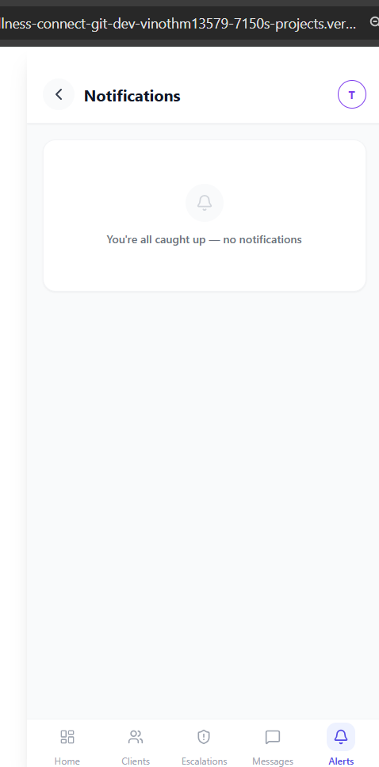

# WellnessConnect — E2E Testing Guide v3 (May 30 2026)

**Dev URL:** `https://wellness-connect-git-dev-vinothm13579-7150s-projects.vercel.app`
**Always test in incognito + hard refresh** (Ctrl+Shift+R) on first load.

This is the updated testing guide that covers everything shipped this week. It supersedes the earlier Testing1.md.

---

## What is WellnessConnect? (2-min orientation)

A platform that connects **clients** with **trainers**, with an **assessment team** as the quality gate.

The flow:
1. A **client** signs up and fills a health profile
2. The **assessment team** reviews them and either clears them (cleared/conditional) or holds them
3. Once cleared, the **recommendation engine** matches them to suitable trainers
4. A **trainer** must also be approved by the assessment team
5. Cleared client + approved trainer connect — sessions, check-ins, risk monitoring

The assessment team is the trust layer. That's the product's core differentiator.

---

## Test accounts (live DB — verified May 30, 2026)

### Clients

| # | Name | Phone | Assessment | Trainer link | Existing data | Use for |
|---|------|-------|------------|--------------|---------------|---------|
| C1 | **Test Client** | `9300000099` | ✅ cleared | active | 5 check-ins, recs present | General client testing |
| C2 | **Arun Kumar** | `9100000011` | ✅ cleared | active | 3 check-ins, recs present | Readiness/adherence testing |
| C3 | **TestClient One** | `9200000001` | ✅ cleared | active | 2 check-ins, recs present | General testing |
| C4 | **Priya Sharma** | `9100000012` | ✅ cleared | active | 1 check-in + meal logs, 0 recs ⚠️ | Meal log testing; recommendation gap case |
| C5 | **ClientVinothAsses** | `9800000001` | ✅ cleared | none | 0 check-ins, recs present | Trainer discovery |
| C6 | **Michael Torres** | `9100000003` | 🟡 conditional | active | 0 check-ins, no client_profiles row | Clean slate for new check-ins |
| C7 | **Alex Johnson** | `9100000001` | ❌ none | none | 0 data | Adversarial — clearance filter |
| C8 | **VClient** | new | ❌ none | — | — | Test signup flow (replace number) |
| C9 | **VClientOne** | new | 🟡 conditional | — | 0 recs ⚠️ | Recommendation gap case |

### Trainers

| # | Name | Phone | State | Use for |
|---|------|-------|-------|---------|
| T1 | **Vinoth Trainer** | `9200000011` | Approved, 2 active clients | Primary — most tests |
| T2 | **VinothTest** | `9200000002` | Approved | Secondary trainer |
| T3 | **Nalinitesta** | `9000000103` | Approved | Fresh trainer |
| T4 | **VTrainerOne** | new | — | Trainer signup/approval tests |

### Assessors

| # | Name | Phone | Notes |
|---|------|-------|-------|
| A1 | **Test Assessor** | `9600000001` | **Use this one** — messaging routes correctly |
| A2 | **Asha Assessor** | `9600000011` | Avoid for messaging tests (known routing issue) |

### New signup numbers (verified unused as of May 30)
- New clients: **9100000060, 9100000061, 9100000062**
- New trainers: **9200000060, 9200000061, 9200000062**

### Login (dev bypass)
Phone: any 10 digits from above · OTP: `123456`
Admin portal (pre-register assessors): app URL + `/admin` → `admin@wellnessconnect.in` / `WellnessAdmin@2026`

---

# PART 1 — Onboarding Gates

---

## TEST 1 — Client signup → assessment gate → app unlock

**Business context:** Front door. A new client must be reviewed before they get full access. If the gate leaks, that's a serious failure — it's the product's core promise.

**Accounts:** new client `9100000060` (Client) + Test Assessor `9600000001` (Assessor)

1. ☐ Incognito → sign up as new client `9100000060` → OTP `123456`
2. ☐ Select **Client** role
3. ☐ Fill the health profile (age, goals, any conditions)
4. ☐ **EXPECT:** land on "assessment pending" screen — NOT the full app
   > 🐛 Known: dashboard may flash for 1–2 sec before bouncing. Auto-corrects.
5. ☐ Confirm: "Check status" button visible, dashboard not reachable
6. ☐ In separate incognito → log in as Test Assessor `9600000001`
7. ☐ Open client queue → find the new client → open assessment form
8. ☐ Complete 8-section questionnaire → **Clear for Training**
9. ☐ Back as the client → tap "Check status" → **EXPECT:** full app unlocks

**Verifies:** Assessment gate, clearance flow.

---

## TEST 2 — Trainer signup → approval gate → activation

**Business context:** Mirror of TEST 1. An unapproved trainer must never appear to clients.

**Accounts:** new trainer `9200000060` (Trainer) + Test Assessor `9600000001` (Assessor)

1. ☐ Incognito → sign up as new trainer `9200000060` → OTP `123456`
2. ☐ Select **Trainer** role
3. ☐ Complete onboarding — photo, certification, specialisations, languages, session types
4. ☐ Submit final step
5. ☐ **EXPECT:** "Your application is under review" — NOT the dashboard
6. ☐ Type `/trainer/dashboard` in URL → **EXPECT:** bounced back to pending screen
7. ☐ Log in as Test Assessor → **Trainer Approval Queue**
8. ☐ Tap the new trainer → **EXPECT:** see full profile (certifications, languages, coaching styles, focus areas, session types, intensity, max clients, experience, rehab/medical flags, bio, phone[...]
9. ☐ **Approve**
10. ☐ Log in as the trainer → **EXPECT:** lands on trainer dashboard

**Verifies:** Trainer approval gate. The Step 8 detail view was newly fixed today.

---

## TEST 3 — Trainer rejection & resubmission

**Business context:** Not every trainer passes first time. Clear feedback + working resubmit.

**Accounts:** trainer from TEST 2 `9200000060` + Test Assessor `9600000001`

1. ☐ As Test Assessor → Trainer Approval Queue → click **Reject** with reason EMPTY
2. ☐ **EXPECT:** blocked — "Please provide a reason for rejection"
3. ☐ Reject WITH reason: **"Please re-upload a clearer certification"**
4. ☐ Log in as the trainer → **EXPECT:** "Your previous submission was rejected" banner with the reason
5. ☐ Tap **"Update profile and resubmit"** → onboarding opens
6. ☐ **EXPECT:** all fields pre-filled with existing data (no blank form)
7. ☐ Change something small → submit
8. ☐ **EXPECT:** back to "under review"
9. ☐ As Test Assessor → approve → trainer reaches dashboard

**Verifies:** Rejection banner, resubmit pre-population (newly fixed today).

---

# PART 2 — Recommendation Engine (NEW — added May 30)

> **Read the "How the recommendation engine works" section above first.** These tests verify the engine produces sensible matches.

---

## TEST 4 — Recommended section appears for cleared clients

**Account:** Arun Kumar `9100000011` (Client)

1. ✅ Log in as Arun Kumar
2. ✅ Go to **Trainers** tab → **Discover** sub-tab
3. ✅ **EXPECT:**
   - Top section: **"Recommended For You"** with 2–5 trainers
   - Each trainer card shows: name, location, experience, match %, View Profile
   - Below: **"All Trainers"** with the rest of approved trainers
   - NO yellow "complete your assessment" banner

| Field | Expected | Actual |
|-------|----------|--------|
| Recommended section visible | Yes | ✅ |
| Number of recommended trainers | 2 | ✅ |
| Top match % | 21% | ✅ |
| Top recommended trainer | Nalinitesta | ✅ |
| Second recommended trainer | VinothTest | ✅ |
| All Trainers section visible below | Yes | ✅ |

✋ **PAUSE — reply with values you saw.** I'll verify against `trainer_recommendations` table.

---

## TEST 5 — Different clients get different recommendations

**Verifies:** The engine considers each client individually, not a single global list.

| Step | Account | What to check |
|------|---------|--------------|
| 1 | Log in as **Test Client** `9300000099` | Note the recommended trainers + match scores |
| 2 | Log out, log in as **ClientVinothAsses** `9800000001` | Note her recommended trainers + match scores |
| 3 | Log out, log in as **TestClient One** `9200000001` | Note his recommended trainers + match scores |

**EXPECT:** The 3 clients see at least some different rankings (e.g., a trainer who's #1 for one client might be #3 for another). If all 3 show the identical list in identical order, the engine isn't [...]

✋ **PAUSE — reply with each client's top 2 trainers and match scores.**

---

## TEST 6 — Uncleared client does NOT see recommendations

**Account:** Alex Johnson `9100000001` (Client, no assessment)

1. ✅ Log in as Alex Johnson
2. ✅ Try to reach **Trainers → Discover**
3. ☐ **EXPECT:** either:
   - ✅ Yellow banner: "Complete your assessment to get personalised trainer recommendations"
   - OR redirect to assessment-pending screen
4. ☐ **NOT acceptable:** Recommendations visible for an uncleared client - recommendation not visible

**Verifies:** H2 trainer clearance filter is in place.

---

## TEST 7 — Backfill button regenerates recommendations

**Account:** Test Assessor `9600000001` (Assessor)

1. ✅ Log in as Test Assessor → land on Assessment Dashboard
2. ✅ Scroll to bottom → **EXPECT:** `[Dev] Backfill Recommendations` button visible
3. ✅ Click it
4. ✅ **EXPECT:** "Running…" state, then green toast: "Backfilled N clients" - Backfill with 2 Clients

Currently expected: toast says "**6**" (4 clients successfully populated, plus 2 attempted-but-skipped due to incomplete profiles — see flagged issues below). - Says Backfill with 2 Clients

✋ **PAUSE — reply with the toast count.** I'll verify the DB shows recommendations for the populated clients.

> 🐛 **Known issue (TEST 7-flag-1):** Toast count is the number of *attempted*, not *successfully populated*. Two clients (Priya Sharma `9100000012` and VClientOne) have complete data but recei[...]

---

## TEST 8 — Priya Sharma's recommendations gap (regression check)

**Account:** Priya Sharma `9100000012` (Client)

1. ✅ Log in as Priya Sharma
2. ✅ Trainers → Discover
3. ✅ **CURRENTLY EXPECTED:** Yellow banner OR empty Recommended section (she has 0 recs despite full profile)
4. ✅ Note what you see

**Verifies:** The known gap. When this is fixed in a future iteration, Priya should show recommendations like any other cleared client.

---

# PART 3 — Daily Check-ins & Readiness Score

---

## TEST 9 — Daily check-in saves + readiness score calculation

**Account:** Michael Torres `9100000003` (Client, clean slate)

### 9.1 — High score baseline
1. ✅ Log in as Michael Torres
2. ✅ Open **Daily Check-in**, enter:
   - Sleep: **8 hours** · Mood: **5/5** · Energy: **5/5** · Water: **8 glasses** · Pain: **0**
3. ✅ Submit

| Field | Expected | Actual |
|-------|----------|--------|
| Readiness score shown | ~80–100 | 90 |
| Colour band | Green | Green |
| Risk alert appeared | No | No |

✋ **PAUSE — reply with the score.** I'll query `daily_metrics`.

### 9.2 — Low score (risk trigger)
4. ☐ Same day, submit again (should upsert, not duplicate):
   - Sleep: **3** · Mood: **1** · Energy: **1** · Water: **1** · Pain: **9**

| Field | Expected | Actual |
|-------|----------|--------|
| New readiness score | ~10–25 | ___ |
| Colour band | Red | ___ |
| Risk alert created | Yes (auto) | ___ |

✋ **PAUSE — reply with the score.** I'll verify: (a) still 1 row for Michael today, (b) whether `risk_alerts` row was created.

### 9.3 — Medium score
5. ☐ Submit again:
   - Sleep: **6** · Mood: **3** · Energy: **3** · Water: **5** · Pain: **3**

✋ **PAUSE.** I'll confirm 1 row total (3 upserts → 1 row).

All the other i given in the previous chat
### 9.4 — Pain score not hardcoded
6. ✅ Open **Progress** screen
7. 🟡 **EXPECT:** Pain shows the value you entered, NOT 0 and NOT "—"  Here is the screenshot. [[Do you mean Pain shows??]]

---

# PART 4 — Workouts & Adherence

---

## TEST 10 — Trainer logs sessions, adherence reflects correctly

**Account:** Vinoth Trainer `9200000011` (Trainer) logging for Arun Kumar (Client)

### 10.1 — Completed session
1. ✅ Log in as Vinoth Trainer
2. ✅ My Clients → **Arun Kumar** → Log Session
3. 🟡 Date: today · Status: **Completed** · Effort: **4/5** · 2 exercises · Notes: blank [I scheduled a session]
4. ✅ Save
5. ✅ **EXPECT:** success toast → returns to client detail

✋ **PAUSE — reply done.** I'll verify: `adherence_score = 80` (not 4), `session_status = 'completed'`, `exercise_sets` rows created, `client_notes` is null.

### 10.2 — No-show session
6. 🟡 Log another session: Status: **No-show** · Notes: **"Did not show up"** [Help me to understand where the status shows. I dont see an option to select No Show. I manually marked few session as completed]
7. ✅ Save

✋ **PAUSE.** I'll verify: `session_status = 'no_show'`, notes contain the text WITHOUT a `[No-show]` prefix, no `exercise_sets` inserted.

### 10.3 — Cancelled by client
8. ✅ Log another: Status: **Cancelled** · Notes: **"Cancelled 2hr before"** [Sun, 31 May, 2026 · 1:00 pm : cancelled the session]

✋ **PAUSE.** I'll verify `session_status = 'cancelled_client'`.

---

# PART 5 — Risk Monitor & Escalation

---

## TEST 11 — Risk Monitor scoping & escalation routing

**Account:** Vinoth Trainer `9200000011` (Trainer)

### 11.1 — Risk Monitor shows correct clients
1. ✅ Open **Risk** tab  
2. 🟡 List clients and severity shown

**Screenshot:**

**Notes:**
- No active alerts or Clients and severity shown


✋ **PAUSE — reply with the names.** I'll cross-check that only Vinoth's clients appear.

### 11.2 — Acknowledge alert
3. 🟡 Tap any alert → detail screen → tap **Acknowledge**
**Notes:**
- No active to show. Refer

**Screenshot:**


✋ **PAUSE.** I'll confirm `is_read = true`.

### 11.3 — Escalate to Assessment Team
4. 🟡 On Risk Alert detail → tap **"Escalate to Assessment Team"**
5. 🟡 Confirm
**Notes:**
- No active to show. Refer

**Screenshot:**

  
  
✋ **PAUSE — reply with client name escalated.** I'll verify: (a) `escalations.assessor_id` is set (not null), (b) matches the assessor who cleared that client, (c) notification fired to that [...]

### 11.4 — Assessor receives
6. ✅ Log in as **Test Assessor** `9600000001`
7. ❌ Open Notifications tab → **EXPECT:** new `risk_escalation` notification at top
8. ❌ Open Escalations tab → assigned to me

**Screenshot:**


**Notes:**
- No risk alert

---

# PART 6 — Clearance Filter & Cross-app Flows

---

## TEST 12 — Trainer clearance filter (Alex Johnson invisible)

**Account:** Vinoth Trainer `9200000011` (Trainer)

1. ☐ My Clients tab → list all clients
2. ☐ **EXPECT:** **Alex Johnson** does NOT appear
3. ☐ Note the active client count on Dashboard
4. ☐ **EXPECT:** count matches the number of cleared clients visible in the list

✋ **PAUSE — reply with the count.** I'll verify against the cleared-clients-only filter.

---

## TEST 13 — Assessment notes appear in Accept-Decline

**Setup needed:** A pending trainer-client link (TEST 1 above creates one).

**Account:** Vinoth Trainer `9200000011` (Trainer)

1. ☐ Open the pending client request
2. ☐ **EXPECT:** above accept/decline buttons, see assessment summary:
   - Clearance badge (cleared/conditional)
   - Fitness level
   - Health notes
3. ☐ If no assessment exists → "No assessment on file" (defense-in-depth)

---

# PART 7 — Nutrition

---

## TEST 14 — Meal log upsert (no duplicates)

**Account:** Priya Sharma `9100000012` (Client)

1. ☐ Open **Nutrition** → Add Meal: **Breakfast** · "Test Breakfast A" · 300 cal · Save

✋ **PAUSE.** I'll confirm exactly 1 breakfast row today.

2. ☐ Add **Breakfast** again: "Test Breakfast B" · 500 cal · Save
3. ☐ **EXPECT:** the list shows Test Breakfast B (500 cal) — NOT both A and B

✋ **PAUSE.** I'll confirm still 1 row, updated to B/500.

4. ☐ Add **Lunch**: "Lunch C" · 600 cal
5. ☐ **EXPECT:** 2 rows today (Breakfast B + Lunch C)

---

# PART 8 — Weekly Reflection

---

## TEST 15 — Weekly reflection persists

**Account:** Test Client `9300000099` (Client)

1. ☐ Open **Weekly Report**
2. ☐ Header shows "Week N · Mon DD — Sun DD" with today in range
3. ☐ Type reflection: **"IST timezone test"** → Save
4. ☐ Navigate to Dashboard, then back to Weekly Report
5. ☐ **EXPECT:** reflection text is pre-populated, not blank

✋ **PAUSE.** I'll verify the row in `weekly_reflections` with correct `week_start` (Monday of IST week).

---

# PART 9 — Client Progress View (Trainer view)

---

## TEST 16 — T15 Client Progress View

**Account:** Vinoth Trainer `9200000011` (Trainer) viewing Arun Kumar (Client)

### 16.0 — Quick spot check (30 sec)
Navigate to: `/trainer/client-progress/aaf9e9b9-6fae-4540-a4a8-2e1416fd5749`

| Field | Expected | Actual |
|-------|----------|--------|
| Client name | Arun Kumar | ___ |
| Avg Readiness (7D) | 62 (will change with TEST 9) | ___ |
| Adherence | depends on TEST 10 | ___ |
| Sleep | 8.3 hrs | ___ |
| Energy | 7/10 | ___ |
| Mood | 7 or 8/10 | ___ |
| Pain | 6.0/10 — lower is better | ___ |
| Current Program visible | Yes | ___ |

### 16.1 — Five sections render
- ☐ SUMMARY cards (2×2)
- ☐ READINESS TREND (14 days) — bar chart, colour-coded
- ☐ METRIC AVERAGES (30 days) — Sleep, Energy /10, Mood /10, Pain
- ☐ RECENT CHECK-INS — table with date, readiness, done indicator
- ☐ CURRENT PROGRAM — program name, week N of M, sessions/week, Edit Program button

### 16.2 — Edit Program navigation
- ☐ Tap "Edit Program" → opens Program Builder for Arun

### 16.3 — Empty state — Michael Torres
- ☐ Open `/trainer/client-progress/33333333-3333-3333-3333-333333333333`
- ☐ **EXPECT:** Sections render with "—" for missing values; no crash

### 16.4 — Alex Johnson edge case
- ☐ Open `/trainer/client-progress/11111111-1111-1111-1111-111111111111`
- ☐ **EXPECT:** Graceful empty state OR "not your client" message
- ☐ **NOT acceptable:** crash, blank page, console error

---

# PART 10 — Visual Consistency

---

## TEST 17 — Avatars and headers (UI consistency)

**Verifies:** Today's UI consistency work.

### Avatar consistency
1. ☐ As **Vinoth Trainer** `9200000011`, check avatar shows **"V"** (NOT "VT") on every screen
   > Exception: dashboard may show photo if user has uploaded one — this is intentional
2. ☐ As **Test Assessor** `9600000001`, check avatar shows **"T"** (NOT "TA") on every screen
3. ☐ As **Test Client** `9300000099`, check avatar shows **"T"** on every screen

### Header consistency
| Screen | Expected | Actual |
|--------|----------|--------|
| Trainer Dashboard | Gradient hero, back-no-arrow | ___ |
| Trainer sub-screens (e.g., My Clients) | White bg, back arrow, title left | ___ |
| Assessor Dashboard | Gradient hero | ___ |
| Assessor sub-screens | White bg, back arrow, title left | ___ |
| Client Home | White bg, NO gradient, calm layout | ___ |
| Client tab destinations (Alerts, Messages, Progress, Trainers) | White bg, NO back arrow (tab destination), title left, avatar top-right | ___ |

> Note: "Tab destinations" do NOT have back arrows — this is intentional. Users got there via tab tap, not drill-down.

---

# PART 11 — Hard refresh & error handling

---

## TEST 18 — Hard refresh doesn't break

**Account:** Any role

1. ☐ Log in
2. ☐ Hit F5 anywhere in the app
3. ☐ **EXPECT:** brief spinner → screen reloads correctly
4. ☐ **NOT acceptable:** flash of login screen, null userId error, blank page

---

# Issues found during this test pass

Add new bugs here as you find them:

| # | Test | Description | Severity | Status |
|---|------|-------------|----------|--------|
| 1 | TEST 1 step 4 | Dashboard flashes briefly before bouncing to "under review" | Medium | Open |
| 2 | TEST 7 | Toast says "Backfilled N" but N counts attempts, not successes | Low | Open |
| 3 | TEST 8 (Priya, VClientOne) | Cleared clients with complete profiles got 0 recommendations | Medium | Open |
| | | | | |

---

# What's already known (don't re-report)

1. **Backfill button is dev-only** — intentionally hidden in production
2. **Weight Trend chart removed** — passive tracking deferred to post-MVP
3. **Asha Assessor (`9600000011`) message routing** — use Test Assessor instead
4. **Edit Profile blank in some cases** — known if it appears outside the resubmit path
5. **`daily_logs` table** — dead schema, will be dropped pre-deploy
6. **RLS is intentionally disabled** — re-enabled with policies before production

---

# After all testing passes — Production cut-over

Three steps:

## Step 1 — Merge `dev` → `main` on GitHub

1. Go to: `https://github.com/VinothMathaiyan/Wellness-Connect`
2. Open Pull Request from `dev` → `main`
3. Review the diff (lots of commits — that's fine; everything tested above)
4. Merge → Vercel auto-deploys to production within ~2 minutes

## Step 2 — Verify production matches dev

Visit: `https://wellness-connect-sigma.vercel.app` (or your production domain)

Run a 5-minute smoke test from this doc:
- TEST 1.1 — sign-up flow loads
- TEST 4 — Arun Kumar sees Recommended section
- TEST 9.1 — daily check-in works
- TEST 17 — visual consistency (avatars + headers)

If smoke test passes on production, you're done.

## Step 3 — Manual housekeeping (pre-launch only)

These items should NOT go to production:
- **Remove the dev-only backfill button** from AssessmentDashboardScreen (or restrict it via deeper auth)
- **Remove `backfillTrainerRecommendations()`** service function
- **Re-enable RLS** with policies per role (separate workstream)
- **Remove hardcoded admin credentials** from the client bundle
- **Wire Twilio** for real SMS OTP
- **Drop `daily_logs`** dead table

These are tracked in `FEATURE_STATUS.md` under "Pre-production hardening".

---

# How to report results

For each test, reply with:

```
TEST 4 — PASS. Recommended section visible, 2 trainers (Nalinitesta 21%, VinothTest 21%)
TEST 9.1 — Score = 87, green band, no alert
TEST 12 — FAIL. Alex Johnson appeared in My Clients list
```

Rules for good reports:
- Describe what you **actually saw**, not what you expected
- For any FAIL: exact test + step number, expected vs actual, screenshot if visual
- If a step was blocked, say so — don't skip silently
